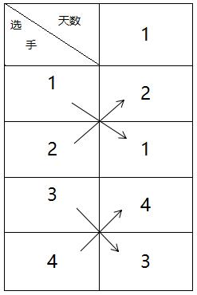

循环赛日程表问题详解
################################

:date: 2017-06-14 12:38
:modified: 2019-11-08 22:37
:tags: 算法
:category: 算法
:authors: IllusiveMan
:summary: 循环赛日程表问题详解

学校开了算法分析与设计课，分治法中讲了循环赛日程表问题。这个问题思路倒不难，主要是程序写起来有点绕，而且书上的程序就是一坨shit。所以我试着自己写篇文章，希望对同样被教材上的程序坑到的同学们有所帮助。

问题
=========

设有n=2k个运动员要进行循环比赛，现要设计一个满足以下要求的比赛日程表：

(1) 每个选手必须与其他n-1个选手各比赛一次。
(2) 每个选手一天只能比赛一次。
(3) 循环赛一共需要进行n-1天。

思路
=========

这部分教材上讲得也还可以。无非就是分治法：要知道一堆人两两比赛的日程不容易，但对半分下去，直到分成两个人比赛，那么日程安排就简单了，直接让这两个人比赛就行了。

由于条件里已经给出，人数一定是2k，所以分到最后就会是许多的二人组。

一个二人组的比赛日程表如下：

.. image:: {static}/image/algorithm_1/01.jpg
  :align: center

由于分组的时候，二人组里的两个人的编号一定是连续的，所以多个二人组的日程表直接上下合并即可：

从图中的箭头可以看出，日程表有这样一个特性：左下角的一部分等于右上角的部分，左上角的部分等于右下角的部分。

接下来完整的日程表也一样：

.. image:: {static}/image/algorithm_1/13.jpg
  :align: center

只不过这次对角复制的范围扩大了。也就是说，每次左下角的值赋给右上角，左上角的值赋给右下角的时候，四个区域是以当前表的大小来确定的，即正好填满这个表的四个区域。

上边的第一行是天数，可以不用管。

于是我们就得到了求解这个问题的方法：先分出一堆二人组，两两比赛，将他们的日程表合并起来，然后不断将左下区间的值复制到右上区间，左上区间的值复制到右下区间即可。

程序设计
===========

这个问题坑就坑在这儿。思路很简单，但就是代码比较绕。课本上的代码变量命名什么的一团糟。我自己重新整理的思路如下：

设选手数为num。

首先第一列肯定是固定的选手编号，先填充好就是了。天数在这个处理中没有太大用，可以无视。但为了在取坐标的时候，数组的下标值能在两个轴向上对应（即避免一个坐标轴上0开始索引，另一个1开始索引），我们还是使用（num+1）*num大小的二维数组。

有了第一列，我们就可以开始根据第一列的值不断构造后面的数据。但是怎么构造呢？我们使用如下的方式：

使用变量s(scale)来控制每次对角复制区域的规模；

规模是从小变大的，在num能容得下不止一个此规模的区域时，要对这些区域进行遍历。

使用变量p(part)来控制每次处理的区域的左上角坐标。

由于规模s大于1时，p只能指明这个区域的起始位置（左上角），还需要对整个区域进行填充，所以必须对区域内进行遍历。

使用变量i、j来遍历一个区域中的所有位置。

下面的图示更形象地展示了这些变量的含义：

.. image:: {static}/image/algorithm_1/4.jpg
  :align: center

上图中，圆角矩形表示受s控制的区域范围。它的意思是，将左上角或左下角的圆角矩形范围这么大一个区域的内容搬过来。

s只控制现在开始要搬多大范围的，具体这么一个数据块摆在哪里，s控制不了。这个由p来控制。上图中所有红色圆圈，代表它所在的操作区域（圆角矩形）的位置，这个位置代表着这个区域的左上角的位置。即，对于每个规模的s，使用p遍历这个规模的所有操作区域，进行搬运工作。

s和p定义了我们要搬运多大的块，搬到哪里，一个块中的所有坐标的具体搬运工作由i和j来控制。

i和j用来遍历一个操作区域中的所有位置，那么我们怎么知道要把哪里的数据搬到这些位置呢？

我们首先要确定的是，搬左上角的数据，还是左下角的数据。我采取的方法是：通过(p+s-1)/s的值是奇数还是偶数来判断。因为对于同一列操作区域，也就是一个s水平下的操作区域，由上到下的搬运对象依次是：左下、左上、左下这样的。(p+s-1)/s确定了当前操作区域在这个规模的所有操作区域里，由上到下排第几。奇数就是搬左下的数据，偶数就是搬左上的数据。

接下来是操作区域内具体位置的搬运工作。我们显然知道，上图右下角的大块要复制左上角大块的内容。那么也就意味着，这个大块中的[1,1]位置(相对坐标)，要复制左上角大块的[1,1]位置的数据。其余位置以此类推。这种情况下，就是用i和j遍历当前操作区域内的所有坐标。i控制区间内的行，以p为初始值，步进值为1，它的范围是小于p+s，如下图所示：

.. image:: {static}/image/algorithm_1/5.jpg
  :width: 500px
  :align: center

j控制区间内的列，一个块中的列数当然也就是s的值。j初始值为s，步进值为1，范围是小于2*s。为什么是2*s，你自己画画草图就明白了。本来每个块的规模都等于它左边所有块的规模。

块中的一个位置和他应该复制数据的位置之间的距离显然也就是规模s。区别就是左上还是左下罢了，而这个问题我们已经解决了。也就是说，数据来源的位置与当前位置的水平偏移量永远是-s，垂直偏移量看左上还是左下，左上就是-s，左下就是s。

至此，我们就建立起这样的程序：不断通过s增大规模，对于每个规模，通过p选择这个规模下的所有块，对于每个块，使用i和j遍历地填充数据。这样程序结构就比较清晰了。

代码
=========

下面是我的代码。

.. code-block:: c++

    #include <iostream>
    using namespace std;
    int main()
    {
        int num;
        cout << "请输入选手数量(要求为2的指数):" << endl;
        cin >> num;
        // 为日程表分配内存
        int **a = new int*[num+1];
        for (int i = 0; i < num+1; ++i)
        {
            a[i] = new int[num];
        } 
        // 填充第一列
        for(int i=0; i<num+1; ++i)
            a[i][0] = i;
        for (int i = 0; i < num; ++i)
            a[0][i] = i;
        // s(scale)控制本次处理的块的规模
        for(int s=1; s<num; s*=2)
        {
            // p(part)控制本次处理的块的起始位置，从上到下遍历同一规模的所有块的左上角位置
            for(int p=1; p<=num; p+=s)
            {
                // i和j循环本次处理的块内的所有内容
                for(int i=p; i<p+s; ++i)
                {
                    for(int j=s; j<2*s; ++j)
                    {
                        // (p+s-1)/s是奇数，取左下
                        if(((p+s-1)/s)%2!=0)
                        {
                            a[i][j] = a[i + s][j - s];
                        }
                        // (p+s-1)/s是偶数，取左上
                        else
                        {
                            a[i][j] = a[i - s][j - s];
                        }
                    }
                }
            }
        }
        // 输出
        // 虽然二维数组实际上是5X4的，但是第一行仅仅是为了运算时取坐标方便和表示天数，没有意义，故不显示
        cout << "日程表" << endl;
        cout << "第一行为天数，第一列为选手号" << endl << endl;
        for (int i = 0; i < num+1; ++i)
        {
            for (int j = 0; j < num; ++j)
            {
                cout << a[i][j] << " ";
            }
            cout << endl;
        }
        cout << endl;
        // 清理
        for (int i = 0; i < num+1; ++i)
        {
            delete[] a[i];
        }
        delete[] a;
        return 0;
    }

